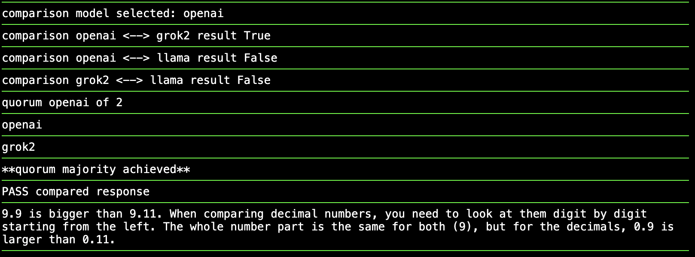

# Triskelion (a triple spiral): AI Model Comparator   

  

## Query and compare multiple AI models (e.g. 3 LLMs) in parallel

Please see   
https://andrekramermsc.substack.com/p/triskelion-an-ai-model-comparator   
and   
https://andrekramermsc.substack.com/p/n-versioning-ai-llm-models   

Query multiple LLMs and compare results to help suppress model errors.   
The models to use and comparison action are configurable (see config.py, comparison.py).   
Different flavous of comparisons are possible. "3-way" is probaly the sweet spot as it can mask one error.   

To install please use the py-install script to locally add ependencies (tested on Python 3.12.3).   
Create files with api keys for the models (start with "source touch-api-keys.sh"):    
claud-api-key, openai-api-key, llama-api-key, grok-api-key gemini-api-key hugface-api-key   
  
You need 3 models configured to be able to mask one error (e.g. using 3-way comparison hence Triskelion).   
Hint: You can use 3 models from HuggingFace by editing the config and adding just one (free) api key   
and set the other api keys to dummy values.

Free to use. USE AT YOUR OWN RISK!

## Usage:   
python3 multillm.py 3-way|2-way|1-way|2-1|3-all|none|n-way prompt   

e.g.   
python3 multillm.py 3-way "Who wrote The Great Gabsby?"    
python3 multillm.py 1-way "What is \"The Magic Number Seven\" about?"   
python3 multillm.py 2-way "toss a coin"   
python3 multillm.py 3-all "How many number ones did the Beatles have in the UK?"   
python3 multillm.py n-way "What is the longest river on Mars?"  

 -- use given text as a prompt for multiple models and perform a comparison.   
             1-way compare two responses    
             2-way compare first response with second and third response    
             3-way compare three responses to see if any two agree     
             2-1 compare 2 responses and go on to a third only if first two disagree    
             3-all compare three responses all ways    
             3-twice compare three responses twice   
             n-way compare all the responses each way   
             none can be used to just query and not do a comparison    

python3 multillm.py xyz input     
-- read input until EOF (Ctrl-D) and use the read input as the prompt with xyz comparison action.    

python3 multillm.py xyz interactive     
--- start an interactive loop to read prompts. You can end this using Crtl-C or by typing "bye".    

## Run as a Web app:  

Install Flash with the steps in py-install file.  

python3 app.py   

Browse to http://127.0.0.1:5000/   
   
or use REST:    
curl -X POST -H "Content-Type: application/json" -d '{"prompt": "Capital of Narnia?"}' http://127.0.0.1:5000/prompt

Example of responses from Web prompt (from Commit 50347e8):  

   
   

